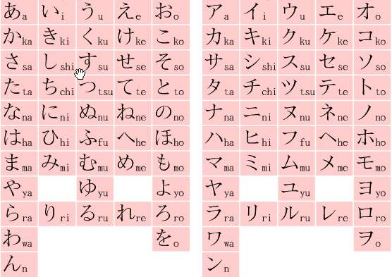

### 日语的组成
#### 汉字
汉字使用平假名进行标注，与中国的汉语写法和读音有所不同。
#### 假名
1. 平假名
一般用于标注汉字的读音，也可用于语气助词和固有词中，类似于中国汉字的草书，形体比较圆润。
2. 片假名
一般用于标注外来词，多数源于中国汉字的偏旁部手，类似中国汉字的楷体，形体比较菱角，使用的频率没有平假名多，但同样重要。
#### 罗马字
一般用于标注假名的读音，也可用于地名、LOGO中。
### 五十音

#### あ　ア

* 联想记忆

啊a！天【安】门好雄伟【啊】！
#### い　イ
* 联想记忆

我【以i】为【依】然一个人！
#### う　ウ
* 联想记忆

【宇u宙】无限大！
#### え　エ
* 联想记忆

唉e？【元】旦还要【工】作啊！
#### お　オ
* 联想记忆

【我o】是天【才】！

